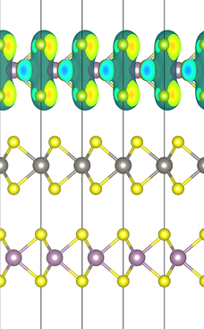
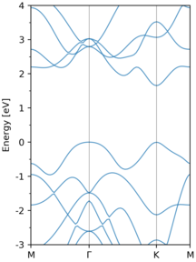

# PyVaspwfc

This is a python class for dealing with `VASP` pseudo-wavefunction file `WAVECAR`.
It can be used to extract the planewave coefficients of any single Kohn-Sham (KS)
orbital from the file.  In addition, by padding the planewave coefficients to a
3D grid and performing 3D Fourier Transform, the pseudo-wavefunction in real
space can also be obtained and saved to file that can be viewed with `VESTA`. 

## Transition dipole moment

With the knowledge of the planewave coefficients of the
pseudo-wavefunction,
[transition dipole moment](https://en.wikipedia.org/wiki/Transition_dipole_moment) between
any two KS states can also be calculated.

## Band unfolding

Using the pseudo-wavefunction from supercell calculation, it is possible to
perform electronic band structure unfolding to obtain the effective band
structure. For more information, please refer to the following article and the
[GPAW](https://wiki.fysik.dtu.dk/gpaw/tutorials/unfold/unfold.html) website.

> V. Popescu and A. Zunger Extracting E versus k effective band structure
> from supercell calculations on alloys and impurities Phys. Rev. B 85, 085201
> (2012)

# Installation

Put `vasp_constant.py` and `vaspwfc.py` in any directory you like and add the
path of the directory to `PYTHONPATH`

```bash
export PYTHONPATH=/the/path/of/your/dir:${PYTHONPATH}
```

requirements

* numpy
* scipy

# Examples

## Wavefunction in real space

```python
from vaspwfc import vaspwfc

wav = vaspwfc('./WAVECAR')
# KS orbital in real space, double the size of the FT grid
phi = wav.wfc_r(ikpt=2, iband=27, ngrid=wav._ngrid * 2)
# Save the orbital into files. Since the wavefunction consist of complex
# numbers, the real and imaginary part are saved separately.
wav.save2vesta(phi)
```

Below are the real (left) and imaginary (right) part of the selected KS orbital:

 | 


## Band unfolding 

Here, we use MoS2 as an example to illustrate the procedures of band unfolding.
Below is the band structure of MoS2 using a primitive cell. The calculation was
performed with `VASP` and the input files can be found in the
`examples/unfold/primitive`


